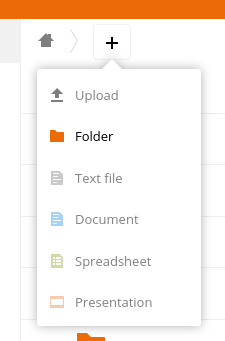
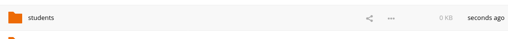
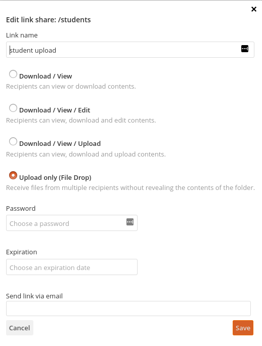
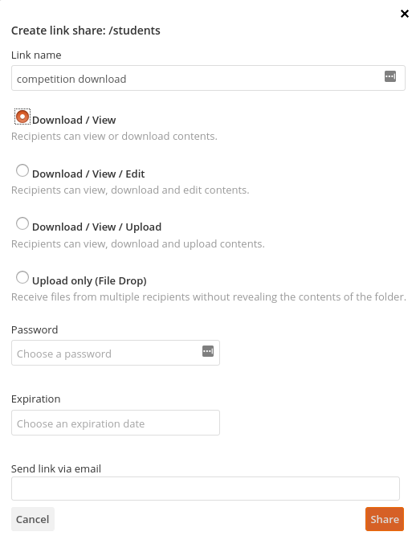
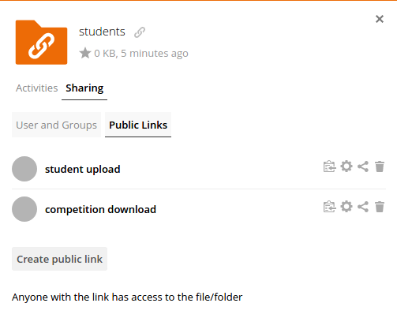

# pacman-contest

This repository adds a single file for "easy" competition running, on top of the `pacman-contest` project in the extensive repository by [Sebastian Sardina et al.](https://github.com/AI4EDUC/pacman-contest-3)  While Sardina has a method for running a competition on multiple systems in [another repository](https://github.com/AI4EDUC/pacman-contest-cluster), this is more complicated than neccessary to use when running on a single system.  The Python-file we supply should be easier to use, and integrates with other [HvA](https://hva.nl) solutions.

## Table of contents
1. [About this repository](#what-does-this-repo-provide-exactly)
2. [Requirements](#requirements)
3. [How to set up](#how-to-set-up)
   1. [SurfDrive](#set-up-surfdrive)
   2. [Secrets file](#set-up-secrets-file)
   3. [Optional: cron](#set-up-daily-runs)
4. [Student information](#student-information)
5. [To-do before teaching again](#what-should-be-done-for-next-year)

## What does this repo provide, exactly?
This repo provides a single file [`competition.py`](competition.py) that will run a round-robin tournament.  Calling `python2 competition.py -h` will show what all the options are.

In summary, the default process has this structure:
1. Load the [secrets file](#set-up-secrets-file)
2. Download student data from SurfDrive
3. Import student files, and report on disqualifying files
4. Make every team play against each other (a [round-robin](https://en.wikipedia.org/wiki/Round-robin_tournament) tournament)
5. Record all replay files
6. Write a `report.html` file
7. Send a zip of all replay files and `report.html` to all teachers and students

## Requirements
As all other parts of [Sardina's original repo](https://bitbucket.org/ssardina-teaching/pacman-projects/), this repo requires a fully-working Python 3.x installation.

On top of that, access to the following services are required:
- A [SurfDrive](https://surfdrive.surf.nl) account.  All HvA staff members with a HvAnetID can log in on SurfDrive.  No installation of SurfDrive is needed on the target device.
- An email account that lets you use its SMTP server, such as the HvA email server.
- If you want to run the competition daily automatically, I'd suggest using [cron](https://en.wikipedia.org/wiki/Cron).

## How to set up
### Set up SurfDrive
Students will upload their test files to a SurfDrive folder, and [`competition.py`](competition.py) will download from that folder, into [`students/`](students/).  To do this properly, we need to make two shared links.  This section will explain how you do that.

1. Go to the [SurfDrive website](https://surfdrive.surf.nl), and log in.

2. Create a new folder.  You will find a big "+" on the top of the website.  Students will upload files to this folder.  They will not be able to see the name of this folder.

   

3. Click on the sharing icon of the newly created folder.  

   

4.  In the right pane in the window, click on "Sharing" and then on "Public Links". Here, we will create two public links.

5. Click on the button "Create public link". Name the link "student upload", and select option "Upload only (File Drop)".  Click on the orange "Share" button.

   

6. Click on the button "Create public link". Name the link "competition download", and select option "Download / View)".  Click on the orange "Share" button.

   

7. In the right pane, you should have something like below.  Use the clipboard icon to copy the urls and store them somewhere where you can easily retrieve them later. 

     

Later in the tutorial, I will refer to the student upload link and competition download link, referring to these two links.

### Set up secrets file
Run `python2 competition.py -S`, and provide the required information.  Below is an example of valid information:
```
$ py2 competition.py -S
We are going to make a new secrets file. 
If hva.secrets already exsists, we will try to recover information from that file when the reply is empty.
Course name: 4100AINT19 
SMTP host: webmail.hva.nl 
SMTP port: 587 
SMTP username: HvAnetID@ad.hva.nl 
Sender email address: my_emailaddress@hva.nl 
SMTP password: **********
Display name: AI Competition Bot 
Comma-separated list of instructor email addresses: teacher1@hva.nl,teacher2@hva.nl
URL to download student data from: competition download link, see above
```

### Set up daily runs
To run a competition every so often automatically, I used [cron](https://en.wikipedia.org/wiki/Cron) on a Linux system. I will explain how to set up cron to run every night at 03.00.

**Notes on choosing how often to compute:**  The teams play in a round-robin tournament: every team faces each other team onces.  For *n* teams, that means there will be *n(n-1)/2* games played.  The system is set up to run one game per hardware threads.  So, roughly speaking, the complete `competition.py` runtime increases quadratically by increasing the number of participating teams *n*, and linearly decreases with the number of number threads.  Make some test runs to see how long computation time on your platform will be.  Take an additional margin of 1 hour between two runs to be sure that there will be no overlapping runs.

You tell cron on which minute (0-59), hour (0-23), day of the month (1-31), month (1-12), and/or day of week (0-6, with 0 = Sunday) some command needs to run.  For each of the datetime values, you can also supply a wildcard symbol `*`, indicating you don't care about that value.  You tell this to cron by calling `crontab -e` (with the `-e` for editing) on the command line, and adding lines.  The lines starthing with a `#` are comments.  As always, you are encouraged to comment your work :grimacing:

In this example, the absolute path to `competition.py` is `/home/pkok/competition.py`, and I have decided to run the program every three hours, starting at midnight.  We will add 8 lines to indicate this.

Start by calling `crontab -e` on the command line.  Add the following lines to the end of the open files:
```
0  0 * * * /home/pkok/competition.py --super-quiet
0  3 * * * /home/pkok/competition.py --super-quiet
0  6 * * * /home/pkok/competition.py --super-quiet
0  9 * * * /home/pkok/competition.py --super-quiet
0 12 * * * /home/pkok/competition.py --super-quiet
0 15 * * * /home/pkok/competition.py --super-quiet
0 18 * * * /home/pkok/competition.py --super-quiet
```

Afterwards, save and close the file.

With these lines we have said: "on any day of the week, in any month, on any day of the month, if it is 0:00, 3:00, 6:00, 9:00, 12:00, 15:00 or 18:00, execute `competition.py` with the command line argument `--super-quiet`.

Remember to remove these lines when the tournament is over! 

## Student information
> Dear student,
> 
> To participate in the competition, we encourage you to test your code often.  We have provided infrastructure for automatically playing test matches against other teams. If you wish to make use of this (beta-testing) facility of your code, keep reading!
> 
> You can upload your single-file agent code to ***student upload link***.  Make sure that your filename has a unique name.  We strongly suggest ***against*** uploading files named `myTeam.py`!
>
> Adding an updated version of this file is easy: just upload it again! This will override the previously uploaded file by that name.
>
> If you wish to receive the results from the test runs, provide a global variable `CONTACT` in your code with your email addresses, separated by commas.  For example: `CONTACT = "wall.e@example.net,baymax@example.com"`.  By doing so, you will receive an email with a zip attached after each run.  In this zip you will find two types of files:
> - In `results.html` you will find a human-readable score sheet. 
> - All other files are replay files. For replay file `REPLAY_FILE`, you can view what happened in that game by calling `python2 capture.py --replay REPLAY_FILE`.
>
> If you wish to stop receiving email updates, re-upload your file without `CONTACT` information.
>
> May the best win!
>
> The AI team

## What should be done for next year?
Always check if [the repository we forked from](https://github.com/AI4EDUC/pacman-contest-3) has new updates!
